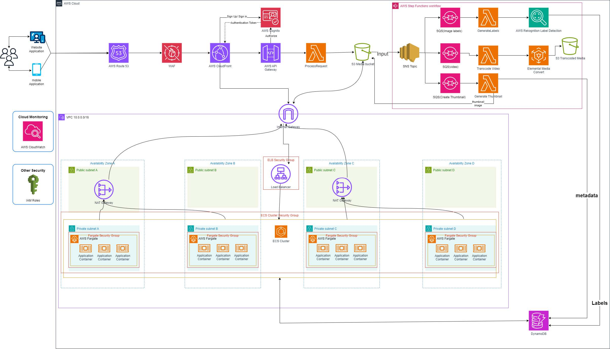

# Photo Album Application - Cloud Computing Capstone Project

- **Figure 1**: Cloud Architecture Diagram

## Project Description
This high distinction capstone project presents a scalable, serverless, and event-driven cloud architecture for a Photo Album application. Designed to meet escalating demand, the architecture leverages AWS managed services to optimize performance, enhance global accessibility, and automate media processing with minimal infrastructure management.

## Business Scenario
The Photo Album application has seen exponential growth, with user demand doubling every six months. To support this expansion, the company required a robust cloud solution capable of handling unpredictable growth, improving global response times, and enabling automated media processing while remaining cost-efficient and easy to maintain.

## Architecture Overview
This cloud architecture incorporates AWS services to fulfill the application’s key requirements:
- **Serverless Compute**: AWS Lambda for event-driven processing, allowing the system to scale seamlessly with user activity.
- **Storage**: Amazon S3 for scalable, reliable media storage with event triggers for automatic processing workflows.
- **Database**: DynamoDB as a NoSQL solution, enabling fast, cost-effective metadata storage optimized for high availability.
- **Content Delivery**: AWS CloudFront and Route 53 for low-latency global content access.
- **Event Management**: SNS and SQS for decoupling tasks, managing asynchronous media processing queues, and preventing application overload.

## Key Features
- **Scalability**: Designed to handle exponential growth through serverless and managed AWS services, supporting increasing demand without sacrificing performance.
- **Global Performance**: Implements latency-based routing and caching to improve response times for a worldwide audience.
- **Cost Efficiency**: Serverless and on-demand services reduce infrastructure costs by scaling dynamically with usage.
- **Media Processing**: Automated generation of thumbnails, mobile-friendly versions, and video transcoding, with an extensible architecture for future AI integrations.
- **Decoupled Design**: Asynchronous processing with SNS/SQS, promoting modularity and scalability in the media processing pipeline.

## Technologies Used
- **AWS Lambda, ECS Fargate** - for serverless compute and containerized workloads.
- **Amazon S3** - for media storage with automatic lifecycle management.
- **Amazon DynamoDB** - for metadata storage.
- **AWS CloudFront, Route 53** - for content delivery and DNS management.
- **Amazon SNS, SQS** - for message queuing and event-driven workflows.
- **AWS MediaConvert, Rekognition** - for media transcoding and AI-based image labeling.

## Assumptions and Constraints
- **Traffic Growth**: Expected to continue doubling every six months, necessitating robust scalability.
- **Media Diversity**: Supports a range of media formats, including image and video processing.
- **AWS Ecosystem**: Entirely within AWS to maintain performance and cost-effectiveness.

## Conclusion
This project provides a robust foundation for the Photo Album application, meeting both current needs and future growth potential. The modular, serverless design ensures that the architecture is highly scalable, secure, and efficient, capable of supporting new features as user demand increases.
